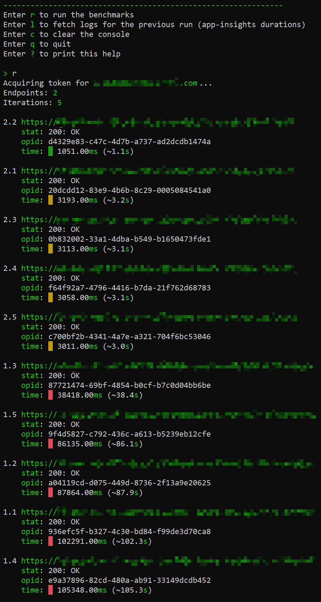

# perfx
Azure API Performance benchmarking tool

---

#### USAGE
`perfx`

  

- Enter **`r`** to **run** the benchmarks
- Enter **`c`** to **clear** the console
- Enter **`q`** to **quit**
- Enter **`?`** to print this **help**

> **PRE-REQ**: Populate the following JSON and save it to your `Documents` folder (`Token` is auto-populated, so leave it blank)
> ```json
> {
>    "Token": "",
>    "UserId": "",
>    "Password": "",
>    "Authority": "",
>    "ClientId": "",
>    "ApiScopes": [
>      ""
>    ],
>    "Endpoints": [
>      ""
>    ],
>    "Iterations": 5
> }
> ```

> Also, see [`"allowPublicClient": true`](https://stackoverflow.com/a/57274706)

---

```batch
# Install from nuget.org
dotnet tool install -g perfx

# Upgrade to latest version from nuget.org
dotnet tool update -g perfx --no-cache

# Install a specific version from nuget.org
dotnet tool install -g perfx --version 1.0.x

# Uninstall
dotnet tool uninstall -g perfx
```
> **NOTE**: If the Tool is not accessible post installation, add `%USERPROFILE%\.dotnet\tools` to the PATH env-var.

##### CONTRIBUTION
```batch

# Install from local project path
dotnet tool install -g --add-source ./bin perfx

# Publish package to nuget.org
nuget push ./bin/Perfx.1.0.0.nupkg -ApiKey <key> -Source https://api.nuget.org/v3/index.json
```