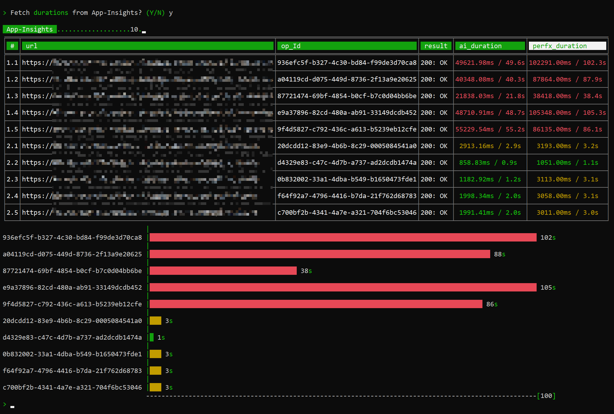

# [perfx](https://github.com/vamsitp/perfx)
An **extensible** Azure API Performance benchmarking tool (for *Developers*) based on **App-Insights**

---

#### USAGE
**`perfx`** [`2`] (to override the number of iterations in the _settings_ file)

> **Optional**: Additional details (e.g. *http-method* (defaults to `GET`) / *headers* / *body* / *query-params*) for the `Endpoints` defined the **`Perfx.Settings.json`** (sample [**here**](Samples/Perfx.Settings.json)) under `Documents/Perfx` can be provided in **`Perfx_Inputs.xlsx`** (sample [**here**](Samples/Perfx_Inputs.xlsx)) under the same folder (or using the *Plugin* model outlined below)
  
> **Note**: By default, if an entry/row for an `Endpoint` exists in `Perfx_Inputs.xlsx`, the corresponding *row-index* of that entry is considered for the specific *iteration*. If the number of entries/rows for an `Endpoint` do not match up with the number of *iterations*, the first entry is taken into consideration for the subsequent iterations

> Results are saved to your `Documents/Perfx` with the name: **`Perfx_Results.xlsx`**/`Perfx_Results.csv`/`Perfx_Results.json` (depending on the specified `OutputFormat` in `Perfx.Settings.json`

  
  

- Enter **`r`**`:10` to **run** the benchmarks (`10` times)
- Enter **`s`** to print the **stats**/details for the previous run
- Enter **`l`**`:1h:10` to fetch **app-insights** `duration` **logs** for the previous run (in the last `1 hour` with `10 retries`) 
- Enter **`c`** to **clear** the console
- Enter **`q`** to **quit**
- Enter **`?`** to print this **help**

> **PRE-REQ**: Populate the following JSON and save it to your `Documents/Perfx` folder with the name: **`Perfx.Settings.json`**
> ```json
> {
>     "UserId": "",
>     "Password": "",
>     "Authority": "https://login.microsoftonline.com/YOUR_COMPANY.onmicrosoft.com",
>     "ClientId": "",
>     "ApiScopes": [
>         "api://YOUR-API-SCOPES"
>     ],
>     "AppInsightsAppId": "",
>     "AppInsightsApiKey": ""
>     "Endpoints": [
>         "https://YOUR-{env}-API.COM/route1",
>         "https://YOUR-{env}-API.COM/route2"
>     ],
>     "FormatArgs": {
>         "env": "dev"
>     }
>     "Iterations": 5,
>     "OutputFormat": "Excel", // "Csv", "Json"
>     "ReadResponseHeadersOnly": false,
>     "InputsFile": "Perfx_Inputs.xlsx", // Headers: One on each line (Excel: ALT + ENTER)
>     "PluginClassName": null
> }
> ```

> **OPTIONAL**: Populate the following JSON and save it to your `Documents/Perfx` folder with the name: [**`Perfx.Settings.json`**](Samples/Perfx.Settings.json)
> ```json
> {
>     "Logging": {
>         "LogLevel": {
>             "Default": "Warning"
>         },
>         "Console": {
>             "IncludeScopes": true,
>             "LogLevel": {
>                 "Default": "Warning" //,"System.Net.Http.HttpClient": "Information"
>             }
>         },
>         "Debug": {
>             "LogLevel": {
>                 "Default": "Information"
>             }
>         }
>     }
> }
> ```

> Also, see [`"allowPublicClient": true`](https://stackoverflow.com/a/57274706)

---
##### EXTEND [(PLUGINS)](https://docs.microsoft.com/en-us/dotnet/core/tutorials/creating-app-with-plugin-support#simple-plugin-with-no-dependencies)

- Create a *.NET Standard* project and add reference to `Prefx.Core` project
- Add a class that implements `IPlugin` interface
- Update the **`csproj`** file as follows:
  - ```xml
    <ProjectReference Include="Perfx.Core.csproj">
        <Private>false</Private>
        <ExcludeAssets>runtime</ExcludeAssets>
    </ProjectReference>
    ```
  - `<TargetFramework>netcoreapp3.1</TargetFramework>`
  - `<CopyLocalLockFileAssemblies>true</CopyLocalLockFileAssemblies>` 
  - Build the project and copy the build-output to `Documents/Perfx/Plugins` folder
  - Optionally, if you have multiple `IPlugin` implementations, you can also update the *value* of `PluginClassName` with the specific implementation-class-full-name (e.g. `MyPluginAssembly.MyPlugin1`)

> Sample: [Perfx.SamplePlugin](Samples/Perfx.SamplePlugin)
---

```batch
# Install from nuget.org
dotnet tool install -g perfx --no-cache

# Upgrade to latest version from nuget.org
dotnet tool update -g perfx --no-cache

# Install a specific version from nuget.org
dotnet tool install -g perfx --version 1.0.x

# Uninstall
dotnet tool uninstall -g perfx
```
> **NOTE**: If the Tool is not accessible post installation, add `%USERPROFILE%\.dotnet\tools` to the PATH env-var.

##### CONTRIBUTION
```batch

# Install from local project path
dotnet tool install -g --add-source ./bin perfx

# Publish package to nuget.org
nuget push ./bin/Perfx.1.0.0.nupkg -ApiKey <key> -Source https://api.nuget.org/v3/index.json
```

---

[**NOTICES**](./Notices.md)
